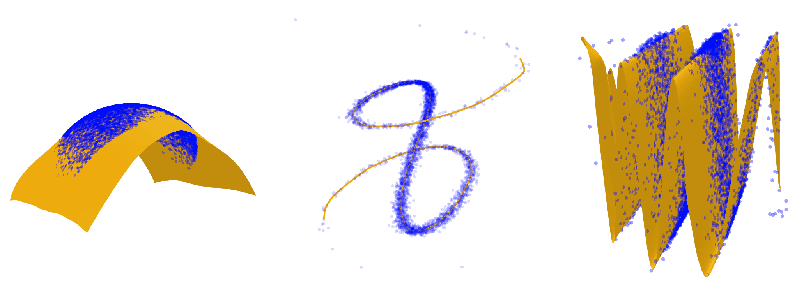

# Score-Based Pullback Riemannian Geometry

This repository contains the official implementation of the paper [Score-Based Pullback Riemannian Geometry](https://arxiv.org/abs/2410.01950) by Willem Diepeveen*, Georgios Batzolis*, Zakhar Shumaylov, and Carola-Bibiane Schönlieb.



## Introduction

In this work, we propose a novel method for learning score-based pullback Riemannian geometries by adapting normalizing flows (NFs). Our approach introduces two key modifications to the standard NF training paradigm:

1. **Anisotropic Base Distribution**: Parameterizing the diagonal elements of the covariance matrix to introduce anisotropy.
2. **\(l^2\)-Isometry Regularization**: Regularizing the flow to be approximately \(l^2\)-isometric.

These modifications enable us to construct a score-based pullback Riemannian metric that yields **closed-form geodesics** through the data probability density and enables **interpretable autoencoding** allowing us to capture the **intrinsic dimensionality** and **geometry** of data. 

We evaluate our method through:

- **Manifold Mapping Experiments**: Assessing the accuracy and stability of learned manifold mappings.
- **Riemannian Autoencoder (RAE) Experiments**: Demonstrating the capability of our method to generate robust RAEs.

---

## Installation and Setup

### Dependencies

Create the conda environment and install necessary packages:

```bash
conda env create -f environment.yml
conda activate id-diff
```

Alternatively, install the required packages using `pip`:

```bash
pip install -r requirements.txt
```

### Datasets

Generate the required datasets before training or evaluation. They will be saved in the `datasets/` folder.

```bash
python sample_dataset.py --dataset dataset_name
```

Replace `dataset_name` with one of the following:

- `single_banana`
- `squeezed_single_banana`
- `river`
- `sinusoid_K_N` (replace `K` with manifold dimension, `N` with ambient dimension)
- `hemisphere_K_N` (replace `K` with manifold dimension, `N` with ambient dimension)

---

## Training and Evaluating Models

To train or evaluate a model, run:

```bash
python train.py --config path-to-config
```

or

```bash
python eval.py --config path-to-config
```

---

## Reproducing Experiments

All experiments from the paper can be reproduced using the provided configuration files.

### Manifold Mapping Experiments

- **Methods**: Our method, Standard NF, Anisotropic NF, Isometric NF
- **Datasets**: Single Banana, Squeezed Single Banana, River
- **Config Files**:
  - `configs/single_banana/`
  - `configs/squeezed_single_banana/`
  - `configs/river/`

### Riemannian Autoencoder Experiments

- **Datasets**: Sinusoid, Hemisphere (with varying intrinsic and ambient dimensions)
- **Config Files**:
  - `configs/sinusoid/`
  - `configs/hemisphere/`

---

## Code Structure

- `configs/`: Configuration files for training and evaluation
  - `single_banana/`, `squeezed_single_banana/`, `river/`, `sinusoid/`, `hemisphere/`
- `src/`: Source code modules
  - `data/`: Data loading and dataset utilities
  - `diffeomorphisms/`: Implementation of diffeomorphisms (normalizing flows)
  - `strongly_convex/`: Strongly convex functions (\(\psi\))
  - `manifolds/`: Manifold classes and pullback manifolds
  - `unimodal/`: Unimodal distribution classes constructed from \(\psi\) and \(\phi\)
  - `riemannian_autoencoder/`: Implementation of the Riemannian autoencoder
  - `training/`: Training utilities and loss functions
  - `evaluation/`: Evaluation metrics and utilities
- `train.py`: Script to train models
- `eval.py`: Script to evaluate models
- `sample_dataset.py`: Script to generate synthetic datasets

---

## Citation

If you find this code useful in your research, please consider citing our paper:

```bibtex
@article{diepeveen2024score,
  title={Score-based pullback Riemannian geometry},
  author={Diepeveen, Willem and Batzolis, Georgios and Shumaylov, Zakhar and Sch{\"o}nlieb, Carola-Bibiane},
  journal={arXiv preprint arXiv:2410.01950},
  year={2024}
}
```

---

## Contact

For any questions, feel free to contact us:

- Georgios Batzolis: [g.batz97@gmail.com](mailto:g.batz97@gmail.com), [gb511@cam.ac.uk](mailto:gb511@cam.ac.uk)
- Willem Diepeveen: [wdiepeveen@math.ucla.edu](mailto:wdiepeveen@math.ucla.edu)
- Zakhar Shumaylov: [zs334@cam.ac.uk](mailto:zs334@cam.ac.uk)
